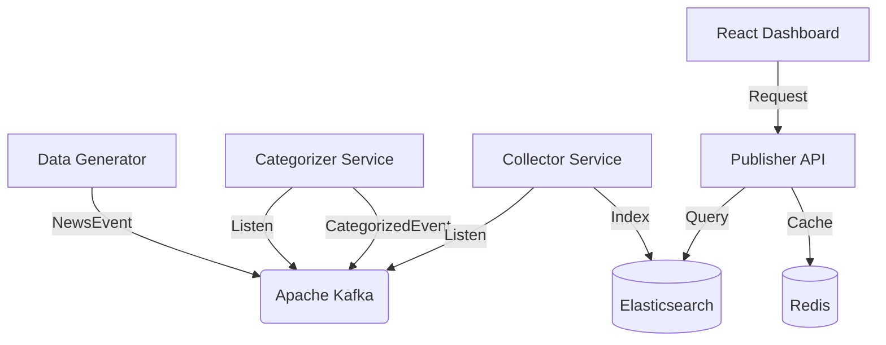

# News Pipeline Analytics Architecture

A high-performance, real-time data ingestion and analytics platform built with Spring Boot, Kafka, and Elasticsearch.

## Logic Flow

## System Components

### 1. Ingestion Layer
- **Producer API**: Provides endpoints to manually post news.
- **Data Generator**: A background service (in Producer API) that emits realistic mock data every few seconds to keep the pipeline saturated.

### 2. Processing Layer
- **Kafka**: The central nervous system.
- **Categorizer Service**: A reactive stream processor that classifies news items based on content.

### 3. Persistence Layer
- **Elasticsearch**: Stores processed events for high-speed full-text search and analytical aggregations.
- **Collector Service**: Bridges Kafka to Elasticsearch.

### 4. Presentation Layer
- **Publisher API**: A RESTful gateway optimized with **Redis Caching** for lightning-fast retrieval of analytics metrics and live feeds.
- **Analytics Dashboard**: A premium, glassmorphism-inspired UI built with **React**, **Vite**, **Tailwind v4**, and **Recharts**.

## Caching Strategy
The system uses Redis heavily in the `publisher-api` to cache:
- Real-time event counts.
- Category distribution metrics.
- Global throughput stats.
This ensures the dashboard remains responsive even under heavy load.
