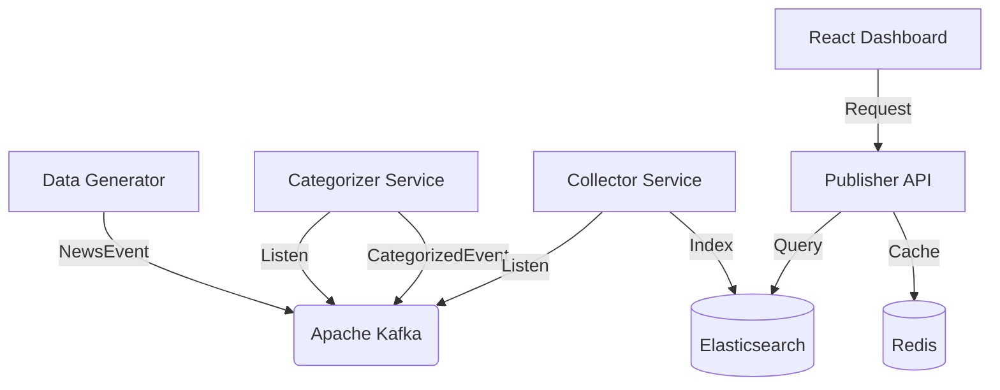

# News Pipeline Analytics Architecture

A high-performance, real-time data ingestion and analytics platform built with Spring Boot, Kafka, and Elasticsearch.

## Logic Flow



## System Components

### 1. Ingestion Layer
- **Producer API**: Provides endpoints to manually post news.
- **Data Generator**: A background service (in Producer API) that emits realistic mock data every few seconds to keep the pipeline saturated.

### 2. Processing Layer
- **Kafka**: The central nervous system.
- **Categorizer Service**: A reactive stream processor that classifies news items based on content.

### 3. Persistence Layer
- **Elasticsearch**: Stores processed events for high-speed full-text search and analytical aggregations.
- **Collector Service**: Bridges Kafka to Elasticsearch.

### 4. Presentation Layer
- **Publisher API**: A RESTful gateway optimized with **Redis Caching** for lightning-fast retrieval of analytics metrics and live feeds.
  - **News API** (`/api/news`): Provides paginated news data with sorting
  - **Analytics API** (`/api/analytics/stats`): Real-time statistics endpoint with Redis caching
    - Returns: Total events, events last hour, unique categories, category distribution, ingestion throughput
    - Cache TTL: 30 seconds for near-real-time updates
  - **Search API** (`/api/news/search`): Full-text search with cached results
- **Analytics Dashboard**: A premium, glassmorphism-inspired UI built with **React**, **Vite**, **Tailwind v4**, and **Recharts**.
  - Fetches data from Publisher API endpoints
  - Uses backend analytics for accurate throughput calculations (avoiding pagination issues)
  - Real-time updates every 3 seconds

## Caching Strategy
The system uses Redis heavily in the `publisher-api` to cache analytics data:

### Cache Configuration
- **Analytics Stats Cache** (`analytics-stats`): 
  - TTL: 30 seconds
  - Caches: Total events, events last hour, unique categories, category distribution, ingestion throughput
  - Purpose: Near-real-time analytics with minimal database load
  - Key: `'current'`
  
- **Search Results Cache** (`news-search`):
  - TTL: 5 minutes  
  - Caches: Search query results by text and page number
  - Purpose: Reduce Elasticsearch load for repeated searches
  - Key: `"#{text}-#{pageNumber}"`

### Cache Error Handling
The system gracefully handles Redis failures:
- If Redis is unavailable, the application falls back to direct Elasticsearch queries
- All cache errors are logged but don't break the application
- Ensures high availability even during infrastructure issues

This ensures the dashboard remains responsive even under heavy load while providing near-real-time data updates.

## Data Flow & Analytics Details

### What Data Flows Through Kafka

#### Event Types:
1. **NewsEvent** (from Producer API):
   - Published to topic: `com.bit.newspipeline.producer.news`
   - Contains: id, title, text, category (initial), datetime
   - Format: Avro serialized with Schema Registry
   - Frequency: Generated every 5 seconds automatically, or on-demand via POST

2. **CategorizedEvent** (from Categorizer Service):
   - Published to topic: `com.bit.newspipeline.categorizer.news`
   - Contains: Enriched news with final category classification
   - Process: Categorizer analyzes title/text and assigns category (Technology, Finance, Sports, Health, Entertainment)

#### Kafka Topics:
- **Producer Topic**: `com.bit.newspipeline.producer.news` (2 partitions)
- **Categorizer Topic**: `com.bit.newspipeline.categorizer.news` (2 partitions)
- **Consumer Groups**: `collectorGroup` (for collector service)
- **Partitioning**: Uses partition key from headers for load distribution

### What Gets Indexed in Elasticsearch

**Index**: `news`

**Document Structure**:
```json
{
  "id": "string",
  "title": "string (analyzed with edge n-gram)",
  "text": "string (analyzed with edge n-gram)", 
  "category": "string (analyzed)",
  "datetime": "ISO-8601 timestamp"
}
```

**Indexing Process**:
1. Collector Service consumes categorized events from Kafka
2. Transforms `CategorizedEvent` to Elasticsearch `News` document
3. Indexes document with custom analyzer for optimal search performance
4. Uses custom analysis with edge n-gram filter for partial matching

**Query Capabilities**:
- Full-text search on title, text, and category
- Time-range queries on datetime field
- Category-based filtering
- Aggregations for analytics (counts, distributions)

### What is Cached and Why

#### 1. Analytics Statistics (Redis Cache: `analytics-stats`)
**What is cached:**
- Total event count
- Events from last hour count
- Events from last 24 hours count
- Unique categories count
- Category distribution map
- Calculated ingestion throughput (events/hour)

**Why cache:**
- **Expensive Operations**: Elasticsearch count queries and aggregations are CPU/memory intensive
- **High Frequency**: Dashboard polls analytics every 3 seconds
- **Query Cost**: Without caching, each dashboard refresh triggers multiple Elasticsearch queries
- **Performance**: Redis lookups are sub-millisecond vs Elasticsearch query time of 10-50ms
- **Load Reduction**: Caching reduces Elasticsearch query load by ~95%

**Cache Strategy:**
- TTL: 30 seconds (balances real-time accuracy with performance)
- Key: `'current'` (single key for all analytics)
- Invalidation: Automatic via TTL, ensuring fresh data every 30 seconds
- Fallback: If cache miss or Redis unavailable, queries Elasticsearch directly

#### 2. Search Results (Redis Cache: `news-search`)
**What is cached:**
- Full-text search results by query text and page number
- Paginated news items matching search criteria

**Why cache:**
- **Repeated Searches**: Users often re-run the same searches
- **Search Cost**: Full-text search with analyzers is more expensive than simple queries
- **User Experience**: Instant results for cached searches improve UX

**Cache Strategy:**
- TTL: 5 minutes (longer than analytics since search results change less frequently)
- Key: `"#{searchText}-#{pageNumber}"`
- Purpose: Reduce Elasticsearch load for common search patterns

#### 3. Cache Error Handling
**Resilience Strategy:**
- If Redis is unavailable, application continues to function
- Falls back to direct Elasticsearch queries
- Errors are logged but don't break the application
- Ensures high availability during infrastructure issues

**Benefits:**
- **Performance**: Sub-millisecond cached responses vs 10-50ms Elasticsearch queries
- **Scalability**: Handles high dashboard load without impacting Elasticsearch
- **Cost Efficiency**: Reduces Elasticsearch query costs significantly
- **Availability**: Graceful degradation ensures service continuity
